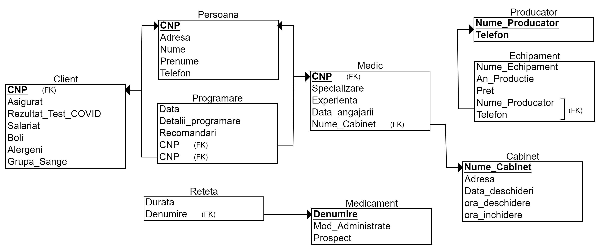

# Proiect_PAO

## Proiect PAO (Programare Cabinet Medical)

### ---------------------------- Achimescu Ionuț-Valentin || Grupa 244 || Proiect PAO -----------------------------

### -------------------------------------- Programări Cabinet Medical ---------------------------------------------

# Am realizat un Proiect PAO cu :

## O reprezentare a datelor din gestiunea unui Cabinet

</img>

### Gestiunea unui Cabinet medical unde se pot face programări de către Medici din cabinet

Cu un meniu interactiv, clasa servicii in care avem metodele:

1. citireDataBase //Citirea din fișiere
2. scriereDataBase //Scrierea in fișiere
3. adaugareClient
4. afisareClient
5. modificareClient
6. statisticaCOVID
7. afisareMedieExperienta
8. afisareCelMaiVechiMedic
9. adaugareProgramare
10. afisareProgramare
11. afisareValoareaMedieEchipamente

## ------------------------ Meniul interactiv cu opțiuni ------------------------

0. Ieșire. (salvare in fișierele .csv a datelor)
1. Adăugare Client in cadrul cabinetului medical.
2. Afișare Clienți in cadrul cabinetului medical.
3. Modificare Client in cadrul cabinetului medical.
4. Ștergere Client in cadrul cabinetului medical.
5. Afișare Număr de Clienți cu COVID/Număr de Clienți (Statistica)
6. Afișare Media anilor de experienta a Medicilor
7. Afișarea celui mai vechi angajat (Medic)
8. Adăugare programare in cadrul cabinetului medical.
9. Afișarea programărilor in cadrul cabinetului medical.
10. Afișarea valorii medii a echipamentelor.

## Etapa 2

1. Am extins proiectul din prima etapa prin realizarea persistentei utilizând fișiere .csv (o mare parte din cod deja era făcut in prima parte deoarece m-am gândit din prima la persistenta datelor pe care le salvam in fișiere .txt)
2. La pornirea programului se vor încărca datele din fișiere utilizând serviciile create
3. Realizarea unui serviciu de audit care scrie într-un fișier CSV de fiecare data când este executata una dintre acțiunile descrise in prima etapa.
4. Am realiza servicii singleton generice pentru scrierea și citirea din fișiere.(WIP)
